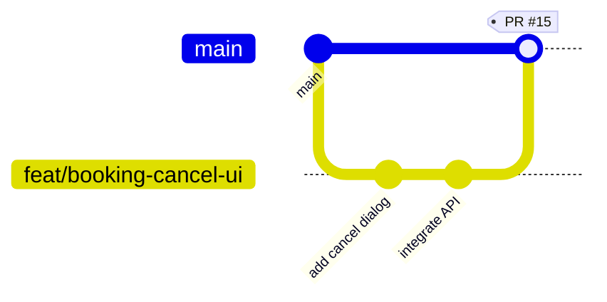

# Contributing to VSP Nest (Frontend)

## Branch Naming

```
feat/description    → new features     (e.g. feat/booking-cancel-ui)
fix/description     → bug fixes        (e.g. fix/login-error-handling)
refactor/description → code cleanup    (e.g. refactor/state-provider)
chore/description   → tooling/deps     (e.g. chore/upgrade-riverpod)
```

## Workflow



### Daily Steps

```bash
# 1. Start a feature
git checkout main
git pull origin main
git checkout -b feat/your-feature-name

# 2. Work & commit
git add -A
git commit -m "feat: short description of change"

# 3. Sync with main (do this daily)
git fetch origin
git rebase origin/main
# If conflicts: fix files → git add -A → git rebase --continue

# 4. Push & create PR
git push -u origin feat/your-feature-name
```

### After PR is merged

```bash
git checkout main
git pull origin main
git branch -d feat/your-feature-name
git push origin --delete feat/your-feature-name
```

## PR Rules

| Rule | Description |
|---|---|
| **1 review required** | Every PR needs at least 1 approval |
| **Small PRs** | Max 300 lines changed. Split large features |
| **Descriptive title** | `feat: add cancel reason dropdown` not `fix stuff` |
| **Description template** | What changed + Why + How to test |
| **No direct pushes to main** | Protected branch — only via PR |
| **Cross-repo features** | Link frontend PR ↔ backend PR in description |

## Commit Message Format

```
type: short description

- bullet point details if needed
```

**Types:** `feat`, `fix`, `refactor`, `chore`, `docs`, `test`

## Code Review Checklist

- [ ] Does it compile? (`flutter analyze`)
- [ ] Do tests pass? (`flutter test`)
- [ ] No debug logs/print statements left behind
- [ ] Follows existing patterns (same folder structure, same naming)
- [ ] New API calls match the backend spec exactly
- [ ] No unused imports
- [ ] Responsive / handles loading + error states

---

## Cross-Repo Examples

These two projects work together. **Backend (API) is always built first**, then Frontend (UI) consumes it.

### Example 1: Booking Cancellation with Reason

**Goal:** Customer adds a reason when cancelling a booking. Backend stores it, frontend shows a dropdown.

| Step | Repo | Branch | Action |
|---|---|---|---|
| 1 | `vsp-net-api` | `feat/booking-cancel-reason` | Add `cancelReason` field to cancel endpoint |
| 2 | `vsp-net-api` | — | PR merged to `main` |
| 3 | `vsp-net` | `feat/booking-cancel-ui` | Add cancel reason dropdown + API integration |
| 4 | `vsp-net` | — | PR merged to `main` |

```bash
# === BACKEND (Step 1-2) ===
cd D:\VSP\vsp-net-api
git checkout main && git pull origin main
git checkout -b feat/booking-cancel-reason

# Edit: CancelBookingRequest.java → add cancelReason field
# Edit: BookingService.java → save the reason
# Edit: BookingController.java → accept new field

git add -A
git commit -m "feat: add cancelReason to booking cancellation API"
git push -u origin feat/booking-cancel-reason
# → Open PR at github.com/shareefshaik2845/vsp-net-api/pulls
# → PR title: "feat: add cancelReason to booking cancellation API"
# → After review, merge to main

# === FRONTEND (Step 3-4, after backend PR is merged) ===
cd D:\VSP\vsp-net
git checkout main && git pull origin main
git checkout -b feat/booking-cancel-ui

# Edit: customer_view.dart → add cancel reason dropdown
# Edit: customer_repository.dart → pass cancelReason to API

git add -A
git commit -m "feat: add cancel reason dropdown in booking UI"
git push -u origin feat/booking-cancel-ui
# → Open PR at github.com/shareefshaik2845/vsp-net/pulls
# → PR title: "feat: add cancel reason dropdown in booking UI"
# → Description: "Depends on vsp-net-api#12"
# → After review, merge to main
```

### Example 2: Role Permissions CRUD

**Goal:** Super Admin can create/edit/delete roles and their permissions.

| Step | Repo | Branch | Action |
|---|---|---|---|
| 1 | `vsp-net-api` | `feat/role-permissions-crud` | Add CRUD endpoints for role permissions |
| 2 | `vsp-net-api` | — | PR merged to `main` |
| 3 | `vsp-net` | `feat/role-permissions-ui` | Build role management pages + forms |
| 4 | `vsp-net` | — | PR merged to `main` |

```bash
# === BACKEND (Step 1-2) ===
cd D:\VSP\vsp-net-api
git checkout main && git pull origin main
git checkout -b feat/role-permissions-crud

# New files:
#   RolePermissionController.java
#   RolePermissionService.java
#   dto/PermissionCreateRequest.java
#   dto/PermissionResponse.java
# Edit: SecurityConfig.java → add endpoint rules

git add -A
git commit -m "feat: add CRUD endpoints for role permissions"
git push -u origin feat/role-permissions-crud
# → PR title: "feat: add CRUD endpoints for role permissions"
# → Merge to main after review

# === FRONTEND (Step 3-4, after backend PR is merged) ===
cd D:\VSP\vsp-net
git checkout main && git pull origin main
git checkout -b feat/role-permissions-ui

# Edit: super_admin_repository.dart → add permission CRUD methods
# Edit: super_admin_view.dart → add permission management UI
# Edit: role_management_view.dart → add permission editor

git add -A
git commit -m "feat: add role permission editor UI for super admin"
git push -u origin feat/role-permissions-ui
# → PR title: "feat: add role permission editor UI for super admin"
# → Description: "Depends on vsp-net-api#15"
# → Merge to main after review
```
