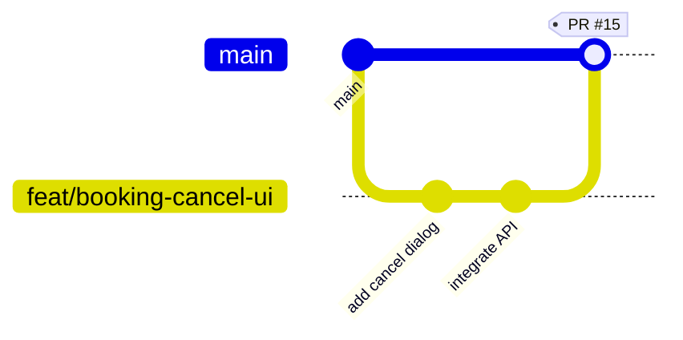

# Contributing to VSP Nest (Frontend)

## Branch Naming

```
feat/description    → new features     (e.g. feat/booking-cancel-ui)
fix/description     → bug fixes        (e.g. fix/login-error-handling)
refactor/description → code cleanup    (e.g. refactor/state-provider)
chore/description   → tooling/deps     (e.g. chore/upgrade-riverpod)
```

## Workflow



### Daily Steps

```bash
# 1. Start a feature
git checkout main
git pull origin main
git checkout -b feat/your-feature-name

# 2. Work & commit
git add -A
git commit -m "feat: short description of change"

# 3. Sync with main (do this daily)
git fetch origin
git rebase origin/main
# If conflicts: fix files → git add -A → git rebase --continue

# 4. Push & create PR
git push -u origin feat/your-feature-name
```

### After PR is merged

```bash
git checkout main
git pull origin main
git branch -d feat/your-feature-name
git push origin --delete feat/your-feature-name
```

## PR Rules

| Rule | Description |
|---|---|
| **1 review required** | Every PR needs at least 1 approval |
| **Small PRs** | Max 300 lines changed. Split large features |
| **Descriptive title** | `feat: add cancel reason dropdown` not `fix stuff` |
| **Description template** | What changed + Why + How to test |
| **No direct pushes to main** | Protected branch — only via PR |
| **Cross-repo features** | Link frontend PR ↔ backend PR in description |

## Commit Message Format

```
type: short description

- bullet point details if needed
```

**Types:** `feat`, `fix`, `refactor`, `chore`, `docs`, `test`

## Code Review Checklist

- [ ] Does it compile? (`flutter analyze`)
- [ ] Do tests pass? (`flutter test`)
- [ ] No debug logs/print statements left behind
- [ ] Follows existing patterns (same folder structure, same naming)
- [ ] New API calls match the backend spec exactly
- [ ] No unused imports
- [ ] Responsive / handles loading + error states
